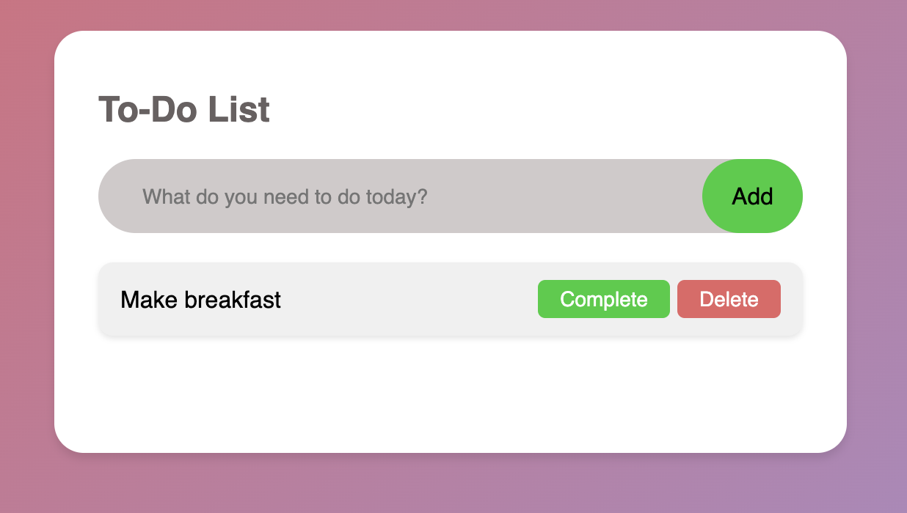

## To-Do List 

## Introduction 
Welcome to the To-Do List application which comes under the K and Triple J portfolio of JavaScript applications. This simple application enables the user to add tasks to be completed for the day. The user is also able to mark the task as completed or delete the tasks from the list. 

## Features

1. Add tasks to the To-Do List 
2. Mark tasks as complete
3. Delete tasks from the to-do list 

## Files 

1. index.html - the main file organising the structure of the application
2. style.css - a file to build the custom design of the application 
3. script.js - a file containing the application logic and interactivity

## Wireframe

## User Stories 
## As a user, I want to add tasks to my to-do list so that I can keep track of what I need to do.
 ### Acceptance Criteria
1. I can type the task details into an input field.
2. I can click an "Add Task" button to add the task to the list.
3. The new task appears in the task list immediately after adding.
### Tasks 
1. Create an input field for users to type in their task details.
2. Add an "Add Task" button next to the input field.
2. Write JavaScript code to:
Capture the input value when the button is clicked.
Add the task to a task list array.
Dynamically update the DOM to display the new task in the list.

## As a user, I want to view my tasks in a list so that I can see everything I need to do at a glance.

### Acceptance Criteria 
1. The task list displays all tasks currently added.
2. Each task is displayed with its name clearly visible.

### Tasks 
1. Create a container element in the HTML to hold the task list.
2. Use JavaScript to:
Loop through the tasks array.
Render each task as a list item in the container.

## As a user, I want to mark tasks as complete so that I can track my progress.

### Acceptance Criteria
1. Each task has a checkbox or button to mark it as complete.
2. When a task is marked complete:
The task text is visually updated (strikethrough)
The task's status in the task list array is updated.

### Tasks 
1. Add a checkbox or "Complete" button next to each task.
2. Write JavaScript code to:
Detect when the checkbox/button is clicked.
Update the task's completed status in the tasks array.
Dynamically update the DOM to show the task as completed (e.g., apply a CSS class for strikethrough or color change).

## Features 

 ### General Features
- **Responsive Design**: Fully functional on desktops, tablets, and mobile devices.
- **Interactive UI**: Easy-to-use interface with smooth animations and transitions.
- **Themed Design**: Modern gradient backgrounds with a polished white task container.
- **Placeholder text in the input box**: Fully functional and shows the user what to do.  

### Adding items on the to-do list - option to complete and delete
- 

### Completing Items on the Do list 
- 

## Future Features 
1. Option to edit the tasks
2. Set a timer on the tasks

## Validator Testing
###HTML
No errors were returned when passing through the official W3C Validator
###CSS
No errors were found when passing through the official Jigsaw CSS Validator

## Technologies Used/Credits 

1. HTML5 
2. CSS3
3. Javascript
4. Chat GPT by OpenAI - aided with debugging and some of the Javascript logic
5. A video tutorial was used to aid with the tougher coding sections: https://www.youtube.com/watch?v=G0jO8kUrg-I&t=823s

 